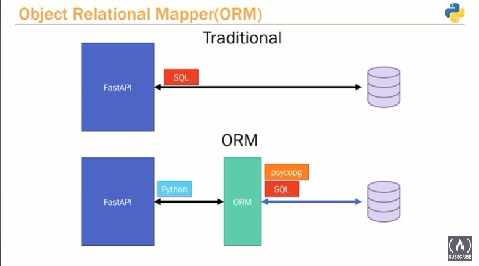
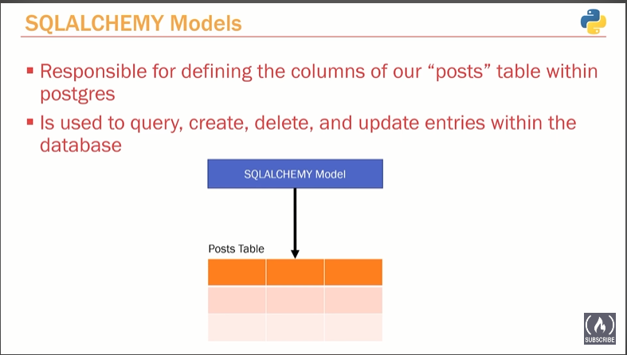
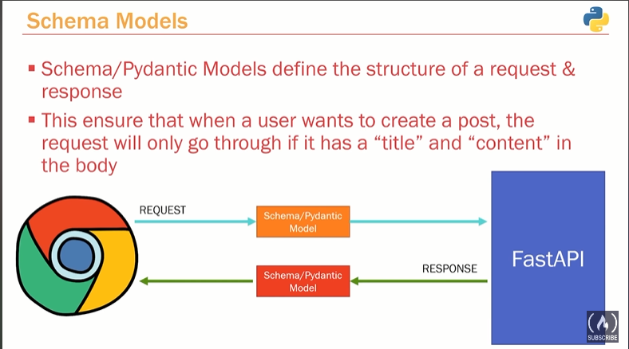
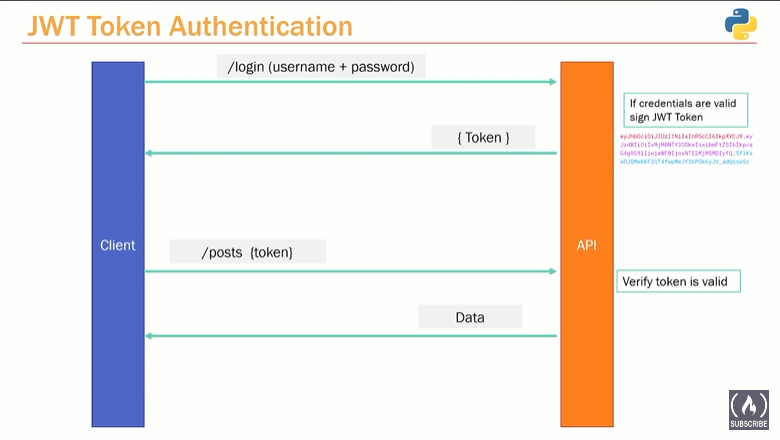
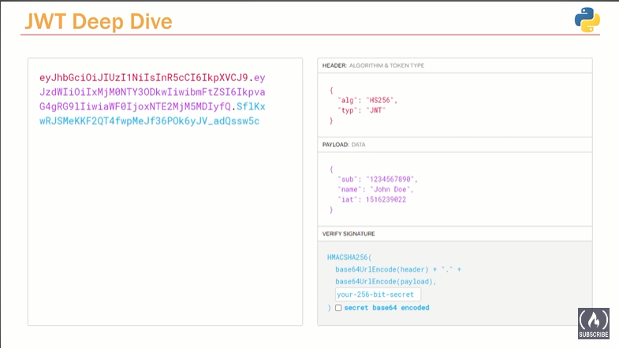
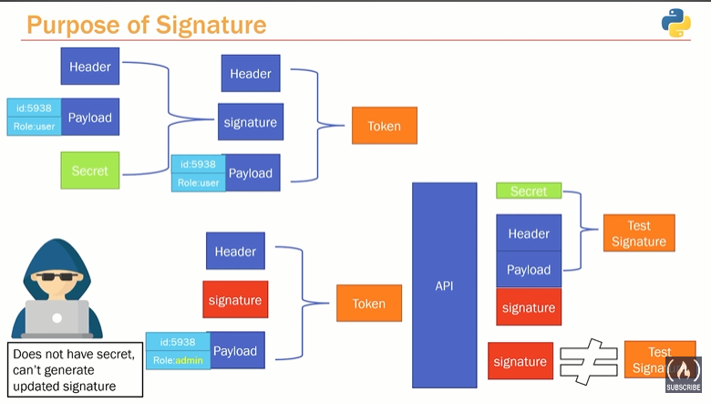

# fast API development

This microservice is responsible for managing smart chatbot operations.

How to set up the project.

1. Install python 3.8 or above if not available
2. Create virtual environment name env in the project folder : `python -m venv env`
3. Move to the project folder and activate virtual environment :
   - in Mac and Linux :source env/bin/activate
   - in Windows : run activate.bat file which is inside \env\Scripts folder by running `env\Scripts\activate`
4. Install required libraries : `pip3 install -r requirements.txt`
5. After stop the project, deactivate virtual environment : deactivate

Run project

1. uvicorn uvicorn app.main:app --reload
2. Swagger documentation is available at : http://{host}:{port}/docs#

Save Dependancies

1. Run `pip freeze > requirements.txt` after installing any pip package

## ORM - Object Relational Mapping

Used in creating a "bridge" between object-oriented programs and, in most cases, relational databases. `SQLAlchemy` is an ORM.

### SqlAlchemy Session

SQLAlchemy is a popular Object-Relational Mapping (ORM) library for Python, which provides a high-level interface to interact with databases using SQL. The SQLAlchemy session is a core component of the library that facilitates the management of database transactions and object persistence.

The SQLAlchemy session allows you to perform various database operations like querying, inserting, updating, and deleting records. Here's a summary of the main concepts and functionalities related to the SQLAlchemy session:

1. Session Configuration: Before using the session, you need to set up the necessary configurations, including the database connection details and engine creation.

2. Session Creation: Once the configuration is set, you can create a session object using the `sessionmaker` function, which acts as a factory for producing new sessions.

3. Unit of Work: The session implements the "Unit of Work" pattern, which means that any changes made to objects within the session are not immediately persisted to the database. Instead, the session tracks the modifications and applies them as a single transaction when requested.

4. Querying: The session provides a powerful querying mechanism through the Query object. You can use methods like `query()` or `query.filter()` to retrieve data from the database based on various conditions.

5. Modifying Objects: You can add, update, and delete objects within the session. SQLAlchemy tracks these changes and synchronizes them with the database when the session is committed.

6. Transaction Management: The session supports transactions, allowing you to group multiple database operations into a single atomic unit. You can start a transaction with `session.begin()` and either commit it (`session.commit()`) or roll it back (`session.rollback()`) based on the success or failure of the operations.

7. Contextual Use: SQLAlchemy provides a context manager (`with` statement) for sessions, which automatically handles the session's lifecycle. It ensures that the session is properly closed, even in the case of exceptions.

8. Session Lifecycle: Sessions have a defined lifecycle, starting with creation and ending with closure. You can use multiple sessions within an application, but it's important to properly manage their scope and lifecycles to avoid issues like resource leaks or stale data.

The SQLAlchemy session is a powerful tool for managing database interactions and object persistence in Python applications. It offers a rich set of functionalities that simplify working with databases and make it easier to handle transactions and data retrieval.

### `SessionLocal` class

Each instance of the `SessionLocal` class will be a database session. The class itself is not a database session yet.

### What ORMs can do

- Defining Tables as python models
- Queries can exclusivly made through python code. No SQL is necessary.

### Models

SQLAlchemy models defines the how database tables looks like.

### Schema Models

Schemas(Pydantic models) define the shape of the requests and responses.

## JWT Authentication

### JWT Toekn

1. Header - Metada about the token(Hashing Algorithm and type of the token)
2. Payload - Information Which we include. Optional
3. Signature - for data intergrity

